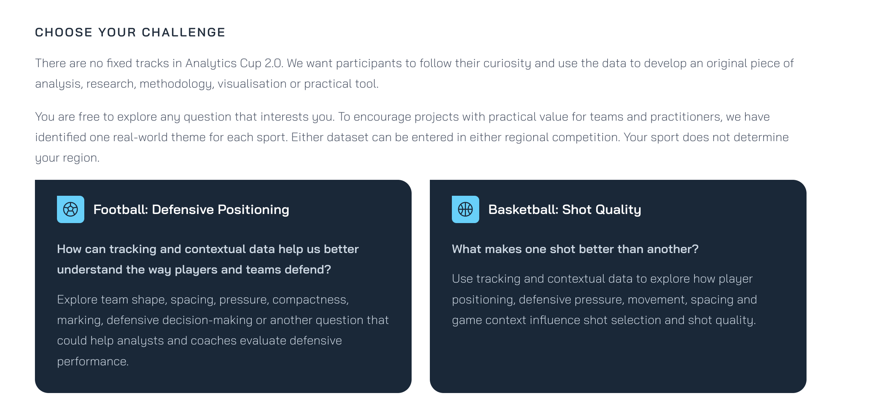

# La challenge: Analytics Cup 2.0

Cosa sappiamo dell'edizione in corso e cosa cambia rispetto alla 2026. Le regole
formali della 2026 (template, limiti di parole e figure) stanno nel
[`CLAUDE.md`](../CLAUDE.md) §5 e in [`plans/02`](../plans/02-costruire-la-submission.md):
valgono finché non esce il template nuovo.

## Fonte

Screenshot della sezione *"Choose your challenge"* del sito della gara, fornito il
04/10/2026. La pagina [pysport.org/analytics-cup](https://pysport.org/analytics-cup)
si carica via JavaScript e da riga di comando non se ne legge il contenuto: per i
dettagli resta da riaprirla nel browser.

## Cosa dice

- **Niente track fissi.** *"There are no fixed tracks in Analytics Cup 2.0."* Si
  può consegnare *"an original piece of analysis, research, methodology,
  visualisation or practical tool"*.
- **Domanda libera, con un tema per sport** scelto *"to encourage projects with
  practical value for teams and practitioners"*.
- **Calcio — Defensive Positioning.** *"How can tracking and contextual data help
  us better understand the way players and teams defend?"* Esempi citati: *team
  shape, spacing, pressure, compactness, marking, defensive decision-making*,
  oppure *"another question that could help analysts and coaches evaluate
  defensive performance"*.
- **Basket — Shot Quality.** *"What makes one shot better than another?"*, con
  posizionamento, pressione difensiva, movimento, spaziatura e contesto.
- **Due dataset, due competizioni regionali.** *"Either dataset can be entered in
  either regional competition. Your sport does not determine your region."*

## Cosa cambia per il workbench

- **La scelta Research / Analyst del piano 01 non esiste più.** La tabella in
  [`plans/01`](../plans/01-scegliere-la-domanda.md) resta come traccia, ma la
  decisione da prendere è un'altra: che tipo di contributo consegnare (analisi,
  metodo, visualizzazione, tool).
- **Il tema del calcio è la difesa**, e nomina esplicitamente pressione e
  decisione difensiva: le stesse famiglie delle piste A e B.
- **"Practical value for teams and practitioners"** diventa un criterio da
  aggiungere ai filtri delle piste.
- **Il template probabilmente cambia.** Il piano 02 parla di un fork di
  `PySport/analytics_cup_<track>`: senza track, il nome e la struttura del
  template 2.0 sono da verificare quando esce.

## Date

Su pretalx l'evento **Analytics Cup 2.0** (`analytics-cup-2`) va dal **09/09/2026
al 18/12/2026** ([API](https://pretalx.pysport.org/api/events/analytics-cup-2/),
letta il 04/10/2026). Il 18/12 è la fine dell'evento su pretalx: con ogni
probabilità è la chiusura delle consegne, da confermare sul sito.

Cosa è già stato presentato nell'edizione precedente, e i repo 2.0 già visibili:
[`gia-presentato.md`](gia-presentato.md).

## Da verificare

- che il 18/12/2026 sia la chiusura delle consegne; regioni e finali;
- quale dataset di basket, e se il dataset di calcio resta quello SkillCorner
  A-League;
- formato della consegna e criteri di giudizio.
