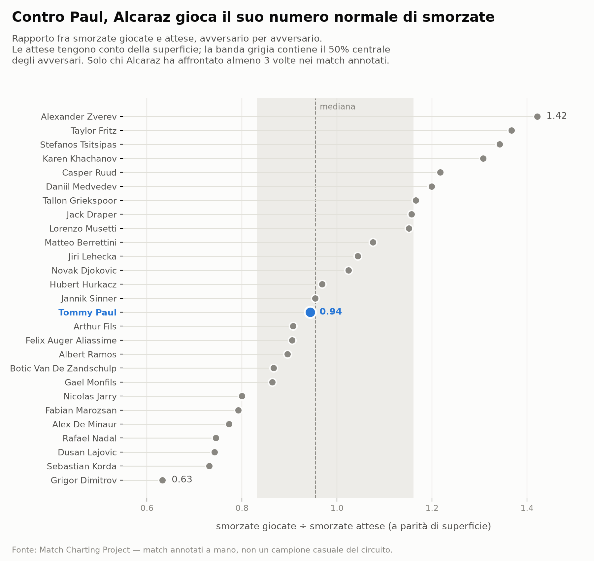
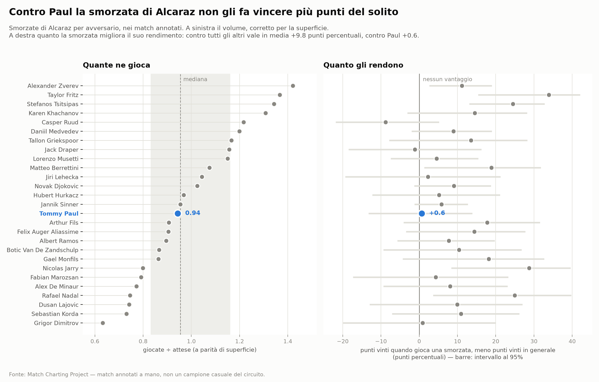

# Alcaraz gioca meno smorzate contro Tommy Paul?

## Domanda

Contro Tommy Paul, Alcaraz usa meno la smorzata del suo solito — perché Paul
gioca vicino al campo — affidandosi di più ai colpi da fondo?

## Dati

- **Fonte**: Match Charting Project, file `charting-m-stats-ShotTypes.csv`
  (riga `Dr` = smorzate, riga `Total` = tutti i colpi) più l'indice dei match.
- **Download**: `python3 -m lib.download mcp --gender m`
- **Campione**: 219 match annotati di Alcaraz, di cui **5 contro Paul**
  (1.730 colpi, 48 smorzate). Il confronto usa i 27 avversari che Alcaraz ha
  affrontato almeno 3 volte con più di 500 colpi annotati.

## Metodo

Il confronto grezzo è fuorviante: Alcaraz gioca 3,73 smorzate ogni 100 colpi
sulla terra e 2,52 sul cemento, e **tre dei cinque match con Paul sono sul
cemento**. Senza controllo si misura il calendario, non l'avversario.

Per ogni avversario si calcolano le smorzate **attese** applicando ai colpi
giocati su ciascuna superficie il tasso di Alcaraz su quella superficie, e si
guarda il rapporto `osservate ÷ attese`. Il tasso di riferimento **esclude i
match contro Paul**, altrimenti il confronto sarebbe circolare.

Il rapporto va poi letto in distribuzione: il numero da solo non dice se sia
alto o basso, lo dice la sua posizione fra gli altri avversari.

## Risultato

**La tesi non regge sul volume.**

```
osservate 48   attese 50,9   rapporto 0,94
posizione 13 su 27 avversari   mediana 0,95
```

Paul cade esattamente sulla mediana. La variabilità fra avversari esiste ed è
ampia — da 0,63 con Dimitrov a 1,42 con Zverev — ma Paul non è un caso
particolare: contro di lui Alcaraz gioca il suo numero normale di smorzate.



**Ma la seconda metà della tesi regge, per altra via** — ed è l'unico effetto
solido che l'analisi produce. Contro Paul, Alcaraz gioca una partita più
ancorata al fondo campo:

| Colpi di Alcaraz (% sul totale) | vs Paul | vs altri |
|---|---|---|
| fondo campo | 96,94 | 95,10 |
| a rete | **3,01** | 4,80 |
| volée | 1,85 | 3,22 |

Sale a rete il 37% in meno del suo solito: su 1.730 colpi, z = −3,44,
**p ≈ 0,0006**. Non è rumore.

**Sulla resa, la lettura giusta è il differenziale.** La percentuale di punti
vinti quando gioca una smorzata non dice niente da sola: contro un avversario
debole è alta perché Alcaraz vince tanti punti comunque. Va confrontata con la
percentuale di punti che vince **complessivamente in quel confronto**.

```
Alcaraz in generale    con smorzata 62,9%   punti in generale 53,3%   →  +9,8
contro Paul            con smorzata 54,2%   punti in generale 53,5%   →  +0,6
```

Contro tutti gli altri la smorzata gli vale quasi dieci punti percentuali in più
del suo rendimento normale. **Contro Paul non gli vale nulla**, ed è il terzo
differenziale più basso su 27 avversari.



Attenzione a non sopravvalutarlo. Il differenziale rende il numero
**interpretabile**, non **significativo**: poiché il rendimento generale di
Alcaraz contro Paul (53,5%) coincide quasi con quello contro tutti gli altri
(53,3%), il confronto statistico resta quello fra i tassi grezzi, cioè
z = −1,27, **p = 0,204**. Con 48 punti l'intervallo di confidenza va dal 40% al
67%, e nel grafico si sovrappone a quasi tutti gli altri.

Va anche detto quale esito si conta, perché cambia il quadro:

| | vs Paul | vs altri | |
|---|---|---|---|
| vincenti puliti | 16,7% | 29,7% | z = −1,96, p = 0,050 |
| forzano l'errore | **14,6%** | 10,3% | |
| decisive (vincenti + forzate) | 31,2% | 40,0% | z = −1,23, p = 0,220 |
| punto poi vinto | 54,2% | 63,1% | z = −1,27, p = 0,204 |

Contro Paul le smorzate producono meno vincenti puliti ma **più errori forzati**.
Guardare i soli vincenti — la fetta con l'effetto più vistoso — darebbe un
risultato apparentemente forte e in realtà fragile: le metriche adiacenti vanno
controllate prima di concludere, non dopo.

## Limiti

- **Il meccanismo proposto non è verificabile con questi dati.** Il MCP non
  registra la posizione dei giocatori in campo: non esiste alcun dato su quanto
  Paul stia vicino alla riga di fondo. I risultati sono *compatibili* con quella
  spiegazione, ma lo sarebbero anche con altre (Paul copre bene il campo in
  generale; Alcaraz gioca le smorzate da posizioni peggiori contro di lui).
  Correlazione, non meccanismo.
- **La resa è suggestiva ma non dimostrata.** Il differenziale contro Paul
  (+0,6 contro +9,8) è il terzo più basso su 27 ed è coerente con la tesi, ma con
  48 punti il test non distingue: p = 0,204, intervallo di confidenza dal 40% al
  67%. Va scritto come indizio, mai come effetto accertato.
- **L'esito scelto cambia la conclusione**: sui soli vincenti l'effetto sembra
  forte (p = 0,050), su ogni misura più ampia svanisce. Le metriche adiacenti
  vanno enumerate prima di guardare i numeri.
- **Il campione annotato pende verso Paul**: 5 dei 8 incontri sono annotati, e
  comprendono entrambe le vittorie di Paul (vedi `../alcaraz-paul-h2h/`).
- Il MCP è annotato a mano da volontari e non è un campione casuale del
  circuito: i tassi qui non sono tassi "del tennis".
- Il rapporto osservate/attese controlla la superficie ma **non** l'anno, il
  formato del match o lo stato di forma.

## Come si riproduce

```bash
python3 -m lib.download mcp --gender m
python3 analyses/alcaraz-paul-smorzate/run.py
```
